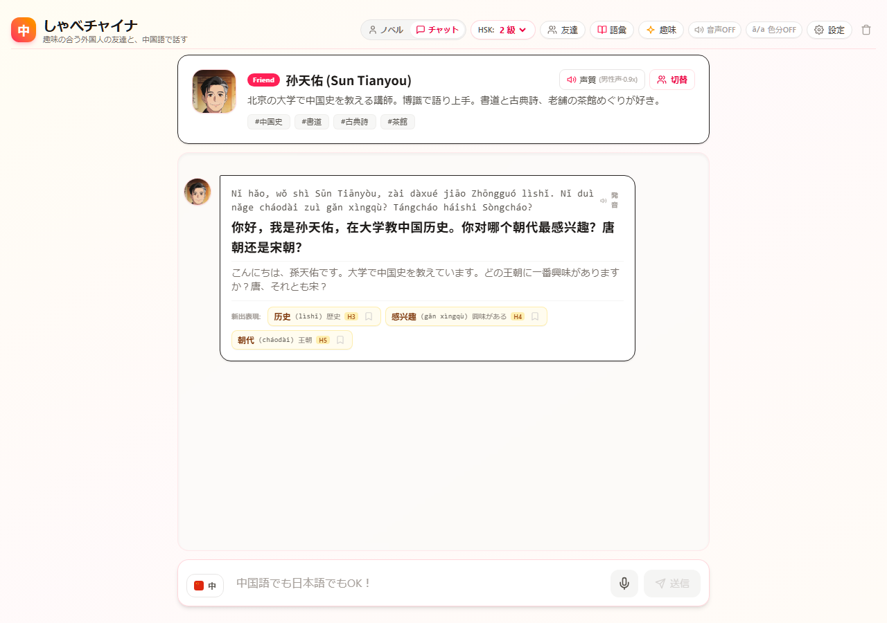
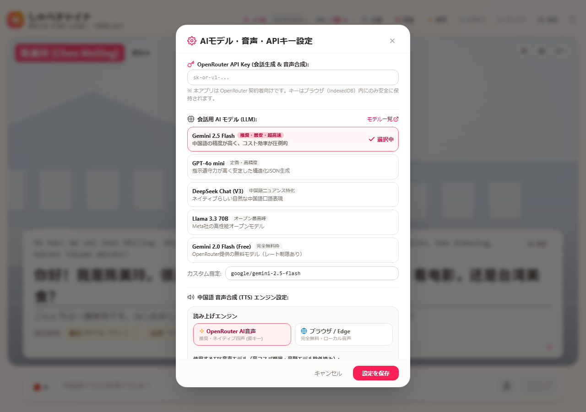
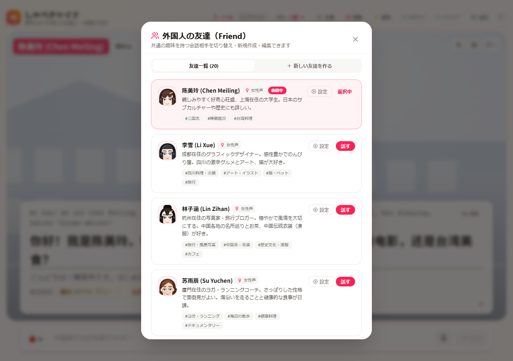
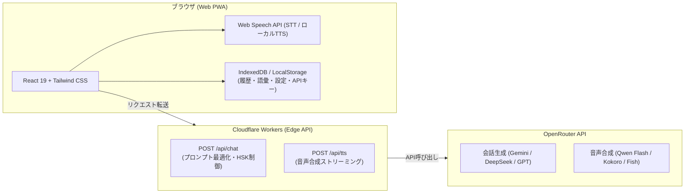

# しゃべチャイナ (Shabe-China) 🇨🇳🗣️

> **「趣味の合う外国人の友達と、中国語で話す。」**  
> 不完全な発話や片言でも会話が自然に弾み、リアルタイムで優しい添削とネイティブ音声が返ってくる、ブラウザ完結型の中国語会話学習 PWA アプリケーションです。

[](https://try-chinese.molkz.com)
[](https://react.dev/)
[](https://www.typescriptlang.org/)
[](https://tailwindcss.com/)
[](https://openrouter.ai/)

🌐 **本番公開URL**: [https://try-chinese.molkz.com](https://try-chinese.molkz.com)

---

## 📸 アプリケーション画面ギャラリー

### 1. メイン会話画面（リアルタイム添削 & ピンイン表示）
趣味の合う友達とのフランクな会話。発話が多少不完全でも意図を汲み取って会話を広げつつ、文末に控えめに改善表現（添削）と新出語彙カードを表示します。



### 2. AI モデル・音声合成（TTS）・キー設定（OpenRouter 1本化）
OpenRouter API キー 1 つで、会話生成（LLM）と最新の音声合成（TTS）の両方を完結。高額モデル（MiniMax等）を排除し、中国語最高峰の Qwen Audio Flash や爆安の Kokoro 82M、無料枠などを選択できます。



### 3. 友達ごとの声質キャラクター設定 & 試聴
AI音声の話者を選ぶと、その友達専用に Kokoro 82M と中国語8話者（男女各4種類）の話者IDを保存します。ピッチだけでなく話者そのものを切り替え、ワンタップで試聴できます。ブラウザ音声は端末に搭載された声のみ利用できます。


※ 画像は以前の画面です。現在は8話者の選択と、試聴に失敗した場合のエラー表示に対応しています。

### 4. 趣味の合う友達キャラクター選択 & 作成
歴史・三国志、アニメ・サブカル、激辛火鍋、フィットネス、写真・旅行など、多彩なバックグラウンドを持つ友達から選んだり、自分だけのオリジナルの友達を作成できます。



---

## ✨ 主な特長・機能

### 1. 片言・不完全な発話ウェルカム設計
- 文法が間違っていても、AI が意図を理解して会話を楽しく盛り上げます。
- メッセージの下部に控えめに **添削（Correction）** が表示され、ワンタップで元の表現と自然なネイティブ表現を比較学習できます。

### 2. HSK 1〜6 級の語彙・文法難易度コントロール
- ヘッダーからいつでも HSK 級（1〜6級）を切り替え可能。
- 級内の単語を中心に会話が構成され、背伸びせずに無理なく会話練習を継続できます。

### 3. 常時ピンイン & 声調カラーハイライト
- すべての中国語メッセージにピンインがルビのように常時並記。
- 第1声（赤）・第2声（橙）・第3声（緑）・第4声（青）・軽声（灰）の声調別ハイライト表示をワンタップで ON/OFF できます。

### 4. OpenRouter 1本化の高コスパ AI 音声合成 (TTS)
- OpenAI API キーなどの複数管理は不要。**OpenRouter API キー 1 つ** で動作します。
- 厳選された高コスパ・最新音声モデルをサポート：
  - **Qwen Audio 3.0 TTS Flash** ($15 / 100万tok・標準推奨): アリババ製。四声や自然な抑揚が世界トップクラス。
  - **Qwen Audio 3.0 TTS Plus** ($20 / 100万tok): さらに繊細な感情表現が可能な上位モデル。
  - **Kokoro 82M** ($4 / 100万tok・超爆安): 驚異的な低コストでトークン消費を最小化。
  - **Fish Audio S2.1 Pro Free** ($0・完全無料枠): テスト・お試しに最適。
  - **ブラウザ標準音声** ($0・完全無料): 端末内蔵の Web Speech API（Edge Neural 等）で通信費ゼロ。

### 5. 音声入力（STT）によるハンズフリー対話
- 音声認識（中国語・日本語両対応）で文字起こしし、送信ボタンで送信します。認識結果の再通知は追記せず更新し、重複入力を防ぎます。録音中は手入力と言語変更を停止し、「完了」後に編集できます。
- 返答の「自動読み上げ」を ON にすれば、本物の音声通話のような会話練習が可能です。

### 6. 語彙帳 & クイズ復習機能
- 会話中に出現した新出表現や添削フレーズを、ワンタップで語彙帳へブックマーク。
- 単語カードめくりや 4 択クイズによる記憶定着トレーニングを内蔵。

### 7. 完全 BYO-AI & プライバシー保護
- ユーザーの API キー、会話履歴、語彙帳データは**すべてブラウザ内（IndexedDB / LocalStorage）にのみ保存**。
- サーバー（Cloudflare Workers）側には一切ユーザーデータを保持しない、セキュアな設計です。

---

## 📖 取扱説明書（使い方ガイド）

### STEP 1: 初期設定（OpenRouter API キーの登録）
1. 右上の **「設定」**（⚙️ アイコン）をクリックします。
2. お手持ちの **OpenRouter API Key**（`sk-or-v1-...`）を入力します。
   - ※ OpenRouter のアカウントをお持ちでない場合は、[openrouter.ai](https://openrouter.ai/) にてアカウントを作成・チャージしてください。
3. お好みの **会話 AI モデル**（推奨: `Gemini 2.5 Flash` または `DeepSeek Chat`）と、**音声合成 TTS モデル**（推奨: `Qwen Audio 3.0 TTS Flash`）を選択して「設定を保存」をクリックします。
   - ※ 音声再生だけをキーなしで試す場合は「ブラウザ」音声を明示的に選んでください。会話AIにはAPIキーが必要です。

### STEP 2: 会話相手（友達）を選ぶ
1. ヘッダーの **「友達」**（👥 アイコン）または上部の友達カードをクリックします。
2. 趣味や性格の合う友達を選択します：
   - **陳美玲 (Chen Meiling)**: 上海在住の大学生。三国志・歴史、中華料理好き。
   - **王浩 (Wang Hao)**: 深センのITエンジニア。ガジェット、SF映画、日本のアニメ好き。
   - **李雪 (Li Xue)**: 成都のUIデザイナー。激辛火鍋、カフェ巡り、パンダ好き。
   - **張偉 (Zhang Wei)**: 北京のパーソナルトレーナー。ジム筋トレ、アウトドア好き。
3. 友達カードの **「声質」** ボタンから、「OpenRouter AI音声」を選び、話者を選択して試聴し、「保存」します。友達別のモデル設定は全体設定より優先されます。ピッチ調整はブラウザ音声専用です。
   - 以前の声設定が保存されている場合は、話者を選び直して保存してください。
   - AI音声には有効なAPIキーと利用料金が必要です。失敗時はブラウザ音声へ自動で切り替えず、会話画面や試聴画面にエラーを表示します。

### STEP 3: 会話を楽しむ
1. 画面下部の入力欄にメッセージを入力するか、マイクボタン（🎙️）を押して話しかけます。
   - **日本語でも中国語でもOK**: 中国語が出てこない時は日本語で話しかけても、友達は親切に中国語で返してくれます。
   - **片言でもOK**: 「我想 去 上海」のような途切れ途切れの文でも、自然に通じます。
2. 友達からの返答が届きます。
   - **ピンイン**: 漢字の上に常時表示されているため、読み方に迷いません。
   - **スピーカーボタン**: クリックするとネイティブな発音で読み上げます。
   - **添削カード**: あなたの発話により自然な表現があれば、優しくアドバイスが表示されます。
   - **語彙カード**: 栞（🔖）アイコンを押すと、即座に「語彙帳」へ保存されます。

### STEP 4: 復習する
1. ヘッダーの **「語彙」**（📖 アイコン）をクリックすると、保存した単語一覧を確認できます。
2. **「復習クイズを始める」** を押すと、フラッシュカードや 4 択クイズで定着度をテストできます。

---

## 🛠️ 技術スタック & アーキテクチャ



| 領域 | 技術 | バージョン / 詳細 |
|---|---|---|
| **Frontend Framework** | React + TypeScript | React 19, Strict Mode, JSX |
| **Build & Bundler** | Vite | Vite 8, `vite-plugin-pwa` (オフライン/インストール対応) |
| **Styling** | Tailwind CSS | Tailwind CSS v4 (Vanilla CSS統合) |
| **Backend & Proxy** | Cloudflare Workers | Hono フレームワーク, エッジ実行 |
| **AI Hub** | OpenRouter API | Text Completions + OpenAI互換 TTS Endpoint |
| **Local Storage** | Web Storage | LocalStorage / IndexedDB (完全クライアント保持) |

---

## 💻 ローカル開発環境の構築手順

### 1. リポジトリのクローン
```bash
git clone https://github.com/Satoshi-Hiramatsu/try-chinese.git
cd try-chinese
```

### 2. 依存関係のインストール
```bash
npm install
```

### 3. 環境変数の設定 (開発用 Worker)
`worker/.dev.vars` を作成し、開発用の OpenRouter API キーを設定します（任意）：
```ini
OPENROUTER_API_KEY=sk-or-v1-xxxxxxxxxxxxxxxxxxxx
OPENROUTER_MODEL=deepseek/deepseek-chat
```
> ※ ユーザー自身のブラウザ上から API キーを入力して利用することも可能です。

### 4. 開発サーバーの起動
```bash
# フロントエンド開発サーバー (http://localhost:5173)
npm run dev:web

# バックエンド開発サーバー (http://localhost:8787)
npm run dev:worker
```

### 5. テスト実行 & ビルド
```bash
# React Hooks 検査 + Web テスト (Node.js) + Workers テスト (Vitest)
npm test

# 全体ビルド (Web + Worker)
npm run build
```

---

## 🚢 デプロイ手順 (Cloudflare Workers)

本リポジトリは Cloudflare Workers の Static Assets 機能を利用して、フロントエンドとバックエンドが単一の Worker として統合デプロイされます。

```bash
# プロダクションビルド
npm run build

# Cloudflare へのデプロイ
npm run deploy:worker
```

---

## 📜 ライセンス

MIT License
