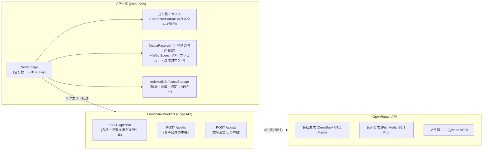

# しゃべチャイナ (Shabe-China) 🇨🇳🗣️

> **「趣味の合う外国人の友達と、中国語で話す。」**
> 片言でも会話が成立し、優しい添削とネイティブ音声が返ってくる。立ち絵つきのサウンドノベル画面で会話する、ブラウザ完結型の中国語会話学習 PWA です。

[](https://try-chinese.molkz.com)
[](https://react.dev/)
[](https://www.typescriptlang.org/)
[](https://tailwindcss.com/)
[](https://openrouter.ai/)

🌐 **公開URL**: [https://try-chinese.molkz.com](https://try-chinese.molkz.com)


---

## 目次

- [しゃべチャイナとは](#しゃべチャイナとは)
- [画面ギャラリー](#画面ギャラリー)
- [主な機能](#主な機能)
- [取扱説明書（使い方ガイド）](#取扱説明書使い方ガイド)
- [登場する友達（20人）](#登場する友達20人)
- [技術スタック & アーキテクチャ](#技術スタック--アーキテクチャ)
- [ローカル開発](#ローカル開発)
- [デプロイ](#デプロイ)
- [ドキュメント](#ドキュメント)
- [変更履歴](#変更履歴)
- [ライセンス](#ライセンス)

---

## しゃべチャイナとは

中国語を「勉強する」のではなく、**趣味の合う友達とおしゃべりする**ことで身につけるためのアプリです。

- 文法が間違っていても、片言でも、日本語混じりでも会話は止まりません。友達が意図を汲んで中国語で返し、そのあとで優しく添削してくれます。
- HSK 1〜6 級の範囲で語彙と文法をコントロールするので、背伸びせずに続けられます。
- 会話画面はチャットではなく**サウンドノベル風の立ち絵つきステージ**。立ち絵とテキスト枠は重ならないよう左右（狭い画面では上下）に分けて配置します。
- 会話は DeepSeek V4.1 Flash、声は Fish Audio S2.1 Pro（どちらも OpenRouter 経由）。利用者が用意するのは **OpenRouter の API キー1つ** です。
- API キー・会話履歴・語彙帳はすべてブラウザ内にのみ保存されます。サーバーはプロキシに徹し、ユーザーデータを保持しません。

---

## 画面ギャラリー

### ノベル画面 — 立ち絵と会話する

立ち絵を左、テキスト枠を右に置くので、会話中も相手の顔が隠れません。ピンイン・中国語本文・日本語訳・新出語彙が1枚のテキスト枠にまとまり、添削は折りたたみで控えめに添えられます。返答の感情は名前の横にラベルで表示されます。


### 立ち絵 — 男女10人ずつ、全20体×10表情

爽やかなアニメ調のイラスト立ち絵です。プリセット20体すべてに、通常・微笑み・喜び・笑い・照れ・驚き・哀しみ・怒り・考え中・ウインクの10表情があり、会話の感情に合わせて切り替わります。趣味・職業・居住地に合わせたシーン背景と組み合わせるため、同じ雰囲気のキャラクターは並びません。


### 表情 — プリセットとカスタム友達の10表情

プリセット20体はイラストの表情差分、自分で作った友達はパラメトリック SVG により10表情を持ちます。LLM が返答ごとに指定した表情へ切り替わり、指定がない場合は返答テキストから推定します。


### レスポンシブ — 縦画面と横画面

| スマートフォン縦画面 | スマートフォン横画面 |
|---|---|
|  |  |
| 立ち絵が上、テキスト枠が下の上下分割 | ヘッダーが畳まれ、立ち絵が画面の下端まで届く2カラム |

横長の画面（PC・タブレット横・スマホ横）では立ち絵を左カラム・テキスト枠を右カラムに分け、縦長の画面では上下に分けます。タイトル・画面モード・HSKは常時表示し、友達・語彙・趣味・音声・設定・履歴削除は「その他」メニューから利用できます。どちらの向きでも本文は立ち絵に重ならず、長い本文と入力内容は各領域内でスクロールできます。

スマートフォン横画面は縦の余白がもっとも貴重なため、専用のレイアウトに切り替わります。約4秒の無操作でアプリのヘッダーごと畳んでその高さを立ち絵へ譲り、立ち絵は画面の下端まで届きます。テキスト枠と入力欄は右カラムにまとまり、本文が入力欄の下に潜り込むことはありません。畳まれたヘッダーと補助操作は画面をタップすれば戻ります。

PWAとしてインストールするとスタンドアロン表示になります。通常のブラウザタブに表示されるアドレスバー等はWebページ側から確実には非表示にできないため、スマートフォン横画面では最初の画面タップで全画面表示を1度だけ試みます。対応ブラウザでは「その他」から全画面表示を開始・終了でき、非対応環境や拒否された場合も通常表示のまま利用できます。

### チャット画面 — 履歴を一覧で振り返る

ヘッダーの「ノベル / チャット」で切り替えられます。ノベル画面からも会話ログとして同じ内容を開けます。


### 友達の選択と作成

20人から選ぶほか、立ち絵・名前・性格・趣味・口調を指定して自分だけの友達を作成できます。声は同性のプリセット友達から借ります。

| 友達一覧 | 友達の作成 |
|---|---|
|  |  |

### 設定と声の高さ

設定画面は OpenRouter API キーと、自動読み上げ・マイクの言語・無音の待機時間・声調カラー・サンプル回答モードです。会話モデルと音声モデルは固定で、画面には出ません。友達の声で変えられるのは「声の高さ」だけで、話者や調整値は開発者モード側で作り込みます。

| 設定 | 声の高さ |
|---|---|
|  |  |

---

## 主な機能

### 1. 片言・不完全な発話ウェルカム設計

文法が間違っていても AI が意図を理解して会話を続けます。返答の下に控えめな **添削（Correction）** が折りたたまれ、開くと元の表現と自然な中国語を比較できます。日本語と中国語を混ぜた発話にも対応し、意味・読み方を尋ねる自然な質問や意図的な言語切り替えは誤り扱いしません。日本語の会話発話には、まず内容へ答えたうえで中国語での言い方を案内します。

### 2. HSK 1〜6 級の難易度コントロール

ヘッダーからいつでも HSK 級を切り替えられます。級内の語彙・文法を軸にしつつ、不自然に硬くならないよう平易な言い換えを優先します。趣味分野の固有表現（作品名・料理名など）は級を超えても積極的に使われます。

### 3. 立ち絵によるゲーム性

- **立ち絵**: バストアップ（腰から頭まで）のイラスト。趣味・職業・居住地に合わせた背景まで描き込まれています。
- **配置**: テキスト枠と重ならないよう左右（狭い画面では上下）に分割。会話中も顔が隠れません。
- **感情**: LLM が返答ごとに指定した感情を、名前の横にラベルで表示します（指定がない場合は返答テキストから推定）。
- **演出**: 友達を切り替えたときのフェードイン、本文のタイプライター表示（タップでスキップ）。
- **カスタム友達**: 自分で作った友達にはパラメトリック SVG の立ち絵を割り当て、10表情・待機モーション・感情エフェクトが有効になります。
- OS の「動きを減らす」設定を有効にしている場合、これらのアニメーションは自動的に停止します。

### 4. 常時ピンイン & 声調カラーハイライト

すべての中国語にピンインを常時併記します。ピンインは `pinyin-pro` の辞書から決定的に生成し、LLMごとの表記揺れを抑えています。第1声（赤）・第2声（橙）・第3声（緑）・第4声（青）・軽声（灰）の色分けをワンタップで ON/OFF できます。

### 5. サンプル回答モード（シャドーイング）

設定でサンプル回答モードをONにすると、友達の返答に対して学習者が次に言える中国語を **「短く返す」「自然に返す」「話を広げる」** の3種類で表示します。各案にはピンインと発音ボタンが付き、音声を聞いてそのまま繰り返すシャドーイング練習に使えます。通常の返答を先に表示し、3案は別リクエストで後から追加するため、会話の返答速度を妨げません。追加のLLM生成を行うため、ONの間は通常よりOpenRouterの利用料が増えます。

### 6. Fish Audio S2.1 Pro による音声合成 (TTS)

会話画面の読み上げは **Fish Audio S2.1 Pro（OpenRouter 経由）** に固定しています。20人それぞれに Fish の話者ID（reference_id）と調整値（temperature / top_p / repetition_penalty など）を割り当て、同じ友達はいつも同じ声で話します。

| 項目 | 内容 |
|---|---|
| モデル | `fish-audio/s2.1-pro`（利用者・開発者とも変更しない） |
| 課金 | UTF-8 バイト課金（中国語1文字 = 3バイト）。利用者の OpenRouter 残高から使われる |
| 声の高さ | 利用者が友達ごとに 0.85〜1.20 の範囲で変えられる。Fish にピッチ指定は無いため、再生速度で音程を変え、Fish に頼む速さを逆数で打ち消して作る |
| 話者ID・調整値 | 開発者モード（`#dev` → 声の管理 / 声設定）で作り込み、`presetFriends.ts` へ転記する |

読み上げは返答全体の生成を待たず、文章を句点で分けて1文目から再生しながら次の文を先読みします。表示用の中国語とは別に読み上げ用テキストを持ち、算用数字を一桁ずつ読む問題を漢数字化などで補正します。

#### TTSモデル検証モード（開発・比較用）

開発者モード（`#dev`）の **「TTS 比較」** タブから **TTSモデル検証モード** を開けます。会話画面の音声は Fish 固定ですが、ここでは同じ中国語・日本語・日中混合テキストを複数モデルで比較し、応答時間、HTTPステータス、推定費用、使用モデル・話者を確認できます。

- **対応モデルは実行時に取得** します。`GET /api/tts/models` が OpenRouter の音声出力モデル一覧を返すため、モデルの追加・価格改定がコード変更なしに反映されます。取得できない場合は既知モデルのみを表示します。
- **話者プリセット** をモデルごとに選べます。OpenRouterが公開する全話者に加え、中国語学習に向く話者を「おすすめ」として先頭に出します。
- **連続生成（1〜5回、既定3回）** に対応します。同じモデル・話者で逐次実行し、1回目・2回目…それぞれの応答速度と、全体平均・2回目以降の平均を表示します。初回のみ遅くなるウォームアップの影響を切り分けられます。
- **声の固定・チューニング** をモデルごとに設定できます。Fish Audio の S1 / S2 系は話者を指定しないと生成のたびに音色が変わるため、話者ID（`reference_id`）の直接入力で音色を固定し、揺らぎ（`temperature` / `top_p`）や繰り返し抑制で読み方のばらつきを抑えられます。「固定重視 / 標準 / 表現重視」のプリセットも用意しています。MAI-Voice は Azure の感情スタイル、OpenAI 系は話し方の自然言語指示に対応します。対応表に無いモデルでも、`provider.options` へ渡すJSONを直接入力して比較できます。
- 各回に個別の再生プレイヤーが付き、発音・自然さ・キャラクター・日中一貫性の5段階評価とメモを残せます。適用した調整値は結果カードと保存履歴にも残ります。

検証は実際のOpenRouter APIを呼び出します。**課金は「モデル数 × 連続生成回数」分** 発生するため、実行前に表示される推定費用を確認してください。直近10件の測定結果はブラウザのIndexedDBに保存されますが、生成音声そのものは保存されません。

#### 応答形式（mp3 / PCM）

OpenRouterのTTSは `mp3` と `pcm` を返します。既定は `mp3` ですが、**Gemini TTS は `pcm` のみ** を受け付けるため、Workers 側がモデルごとに形式を出し分けます。PCMはヘッダーを持たない生データでブラウザが再生できないため、受信後にWAVヘッダーを付けて再生します（変換はストリーム受信の完了後に行うため、応答速度の計測値には影響しません）。未知のモデルが形式不一致を返した場合も、指定された形式で1回だけ自動再試行します。

### 7. 音声入力（STT）

中国語・日本語の両方に対応した音声認識で文字起こしし、確認してから送信します。マイク音声は `MediaRecorder` で一発話として録音し、停止後に `/api/stt` へ1回だけ送ります。送信内容の正本はこの一括結果だけなので、認識セッションの再開による文字列の重複は発生しません。録音と並行してブラウザの音声認識を動かし、話している途中の文字をプレビューとして表示します（入力欄や送信内容には入りません）。音声入力の開始時と回答受信後は入力欄へ自動フォーカスしないため、Androidのソフトキーボードは入力欄を直接タップするまで表示されません。

返答の「自動読み上げ」をONにすれば、音声通話のように練習できます。入力欄の **HF** を押すと、一発話ずつ録音・文字起こし・送信するハンズフリー会話を開始します。沈黙だけでは送信されないため、言葉を考えている途中でも大丈夫です。中国語入力では発話の最後に「发送（fāsòng）」、日本語入力では「送って」と言うと、コマンド部分を除いた本文だけを送信します。友達の返答を読み上げた後はマイクが自動で再開します。HF はページを開くたびに明示的な開始が必要です。

### 8. 語彙帳 & 復習

会話で出た新出表現や添削フレーズを栞アイコンで語彙帳に保存し、フラッシュカードと4択クイズで復習できます。

### 9. 完全 BYO-AI & プライバシー保護

会話と読み上げの費用は利用者自身の OpenRouter キーから支払われ、アプリの運営側に費用は回りません。API キー・会話履歴・語彙帳はすべてブラウザ内（IndexedDB / LocalStorage）にのみ保存されます。Cloudflare Workers 側はリクエストの転送に徹し、ユーザーデータを保持しません。

---

## 取扱説明書（使い方ガイド）

### STEP 1: OpenRouter API キーを登録する（必須）

会話と読み上げには OpenRouter の API キーが必要です。タイトル画面のメニューに「APIキー」があり、`未設定 · はじめる前に登録してください` のように状態が出ます。キーが無いまま会話を始めようとすると、理由つきでキー入力の画面が開きます。

1. [openrouter.ai/settings/keys](https://openrouter.ai/settings/keys) でキー（`sk-or-v1-...`）を作成し、少額（$5 程度）をチャージします。
2. タイトル画面の **「APIキー」**、または会話画面ヘッダーの **キー状態バッジ** を押してキーを貼り付け、「確認」で有効か調べてから「保存」します。設定画面（「その他」→「設定」）の先頭にも同じ入力欄があります。

キーの状態は **未設定 / 有効 / 無効 / 残高切れ** で表示します（通常のキーではアカウント残高そのものは取得できません）。会話や音声が残高切れ（402）で返ると、その場で「残高切れ」になって会話が止まります。チャージ後にバッジから「確認」し直してください。別のモデルへ黙って切り替えることはありません。

テスターの方は [docs/テスター向けガイド.md](docs/テスター向けガイド.md) も参照してください。

### STEP 2: 会話相手（友達）を選ぶ

1. ノベル画面の友達アイコン、またはヘッダーの **「友達」** を押します。狭い画面では **「その他」→「友達」** から開けます。
2. 20人の中から趣味や性格の合う相手を選んで「話す」を押します。
3. 「設定」からプロフィールや立ち絵を変更できます。オリジナルの友達も作成できます。声は同性のプリセット友達から借ります。
4. 立ち絵横の ⚙️（チャット画面では「声の高さ」ボタン）から、その友達の **声の高さ** を「低め〜高め」で変えられます。試聴して「保存する」を押すと、その友達だけに記録されます。話者や速さは変えられません。

#### 開発者モード

URLの末尾に `#dev` を付けると開発者モードが開きます。通常利用の導線からは分離されています。旧入口の `#admin` は `#dev` の「声の管理」タブへ転送されます。

- **キャラクター**: 20体の立ち絵・10表情・声・プロフィールを一覧確認し、ブラウザ上で調整できます。プリセットとの差分はコードとして書き出せます。
- **声の管理**: 20人の話者ID・調整値を一覧し、カード上で直接変更・試聴できます。話者ID未設定と重複をバッジで警告し、TTS 検証モードで保存した Fish の結果を取り込めます。全員の声設定を `presetFriends.ts` へ転記できる TypeScript コードとして書き出せます。
- **テストモード**: 会話モデル（既定 DeepSeek V4.1 Flash）をこの端末だけ上書きします。上書き中は通常画面のヘッダーに「テストモード中」が出ます。全員の声の上書きをプリセットに戻すボタンもここにあります。
- **STT比較 / LLM比較 / TTS比較**: 同じ入力を複数モデルへ送り、品質・レイテンシ・実費を比較します。TTS 比較は OpenRouter が音声出力に対応する全モデルを扱えます。

個人利用を前提としているため認証は設けていません。共有端末では URL の扱いにご注意ください。比較機能は利用者自身のキーで課金されます。

### STEP 3: 会話を楽しむ

1. 画面下部の入力欄に入力するか、マイクボタン（🎙️）で話しかけます。
   - **日本語でも中国語でも OK**: 中国語が出てこないときは日本語で構いません。
   - **片言でも OK**: 「我想 去 上海」のような途切れた文でも通じます。
   - **音声入力**: マイク入力後はAndroidのキーボードを自動表示しません。文字を直す場合だけ入力欄をタップしてください。
   - **ハンズフリー**: **HF** を押し、中国語なら最後に「发送」、日本語なら「送って」と言います。沈黙では送信されません。終了するときは HF または停止ボタンを押します。
2. 返答が届きます。
   - **感情**: 返答内容に合わせた感情が、名前の横にラベルで表示されます。
   - **ピンイン**: 本文の上に常時表示されます。
   - **発音ボタン**: ネイティブ音声で読み上げます。
   - **添削**: より自然な表現があれば「添削アドバイス」として折りたたまれます。
   - **新出表現**: 栞（🔖）アイコンで語彙帳に保存できます。
3. 本文はタイプライター表示されます。待ちきれないときはテキスト枠をタップすると全文が出ます。
4. ステージ上の会話ログボタンで過去のやり取りを振り返れます。補助ボタンは約4秒操作がない場合や入力欄のフォーカス中に隠れ、画面をタップすると再表示されます。

### STEP 4: 復習する

1. ヘッダーの **「語彙」** で保存した単語一覧を確認します。狭い画面では **「その他」→「語彙」** から開けます。
2. **「復習クイズを始める」** でフラッシュカードと4択クイズに進みます。

---

## 登場する友達（20人）

立ち絵・声・出身地・職業・趣味がそれぞれ異なります。

### 女性

| 名前 | 居住地・職業 | 趣味 |
|---|---|---|
| 陈美玲 (Chen Meiling) | 上海・大学生 | 三国志、映画鑑賞、台湾料理 |
| 李雪 (Li Xue) | 成都・グラフィックデザイナー | 四川料理・火鍋、アート、猫、旅行 |
| 林子涵 (Lin Zihan) | 杭州・写真家 / 旅行ブロガー | 風景写真、中国茶、歴史文化・漢服 |
| 苏雨辰 (Su Yuchen) | 厦門・ヨガ / ランニングコーチ | ヨガ、海辺の散歩、健康料理 |
| 周暖 (Zhou Nuan) | 昆明・パティシエ見習い | お菓子作り、花・植物、パンダ |
| 何静怡 (He Jingyi) | 深圳・金融アナリスト | 読書、ジャズ、都市・建築、語学学習 |
| 唐小雨 (Tang Xiaoyu) | 重慶・バンドのベーシスト | 音楽、ライブハウス、夜景、バイク |
| 郭珊珊 (Guo Shanshan) | 西安・考古学専攻の大学院生 | 歴史・遺跡、バックパック旅行、西安グルメ |
| 顾安琪 (Gu Anqi) | 大連・通訳者 | インテリア、映画音楽、静かなカフェ |
| 沈若熙 (Shen Ruoxi) | 長沙・家庭料理店の若女将 | 湖南料理、市場めぐり、ドラマ鑑賞 |

### 男性

| 名前 | 居住地・職業 | 趣味 |
|---|---|---|
| 王浩 (Wang Hao) | 北京・IT エンジニア | テクノロジー・AI、ゲーム、SF小説 |
| 张伟 (Zhang Wei) | 広州・フィットネスインストラクター | ランニング、広東飲茶、スポーツ観戦 |
| 陈宇 (Chen Yu) | 蘇州・造園職人 | 庭園・盆栽、園芸、二十四節気 |
| 李俊 (Li Jun) | 深圳・ストリートダンサー / DJ | ダンス、ヒップホップ、スニーカー |
| 赵浩然 (Zhao Haoran) | 武漢・大学生（eスポーツ部） | eスポーツ、アニメ、武漢グルメ |
| 孙天佑 (Sun Tianyou) | 北京・大学講師（中国史） | 中国史、書道、古典詩、茶館 |
| 吴一帆 (Wu Yifan) | 青島・海鮮レストランのシェフ | 海鮮料理、釣り、ビール、市場めぐり |
| 徐世勋 (Xu Shixun) | 杭州・ゲーム開発者 | ゲーム開発、SF映画、ボードゲーム |
| 高光耀 (Gao Guangyao) | 新疆・ツアーガイド | シルクロード、羊肉料理、砂漠の星空 |
| 郑志远 (Zheng Zhiyuan) | 天津・ジャズ喫茶のマスター | コーヒー、ジャズ・レコード、古い映画 |

---

## 技術スタック & アーキテクチャ



| 領域 | 技術 | 詳細 |
|---|---|---|
| **Frontend** | React + TypeScript | React 19, Strict Mode, `any` 不使用 |
| **Build** | Vite | Vite 8, `vite-plugin-pwa`（オフライン / インストール対応） |
| **Styling** | Tailwind CSS | Tailwind CSS v4 + 素の CSS（アニメーション・レイアウト） |
| **キャラクター** | イラスト画像 + インライン SVG | プリセット20体はイラスト立ち絵。カスタム友達は SVG をパラメータで生成 |
| **Backend** | Cloudflare Workers | Hono、エッジ実行、Static Assets で SPA も同居 |
| **AI Hub** | OpenRouter API | Chat Completions + 音声合成 + 文字起こし |
| **保存先** | Web Storage | LocalStorage / IndexedDB（完全クライアント保持） |

### 主要ディレクトリ

```
web/src/
├── components/
│   ├── NovelStage.tsx          ノベル画面（立ち絵 + テキスト枠）
│   ├── PortraitFace.tsx        立ち絵から切り出す顔アイコン
│   ├── CharacterPortrait.tsx   SVG 立ち絵の描画（カスタム友達用のフォールバック）
│   ├── SceneBackdrop.tsx       SVG 立ち絵の背景シーン
│   ├── ChatLogModal.tsx        会話ログ（バックログ）
│   ├── DevConsole.tsx          開発者モード（キャラクター / 声の管理 / テストモード / STT / LLM / TTS）
│   ├── CharacterAdminPane.tsx  立ち絵・声・プロフィールの管理
│   ├── VoiceAdminDashboard.tsx 声の管理（話者IDの一覧・試聴・書き出し）
│   ├── DevTestModePane.tsx     テストモード（会話モデルの上書き）
│   ├── VoicePitchModal.tsx     利用者向け「声の高さ」
│   ├── VoiceSettingsModal.tsx  開発者向け声設定（話者ID・調整値）
│   ├── TtsDebugModal.tsx       OpenRouter TTSモデル検証画面
│   ├── VoiceTuningFields.tsx   声の固定・チューニング入力（検証／声設定で共有）
│   └── ...                     ヘッダー・入力欄・各種モーダル
├── data/
│   ├── portraits.ts            立ち絵の定義（20体・イラストURLの解決）
│   ├── portraitParts.ts        SVG 立ち絵の髪型・体型パス定義
│   ├── presetFriends.ts        プリセットの友達（20人）と Fish の話者ID
│   ├── fishVoice.ts            固定音声モデル・話者IDの判定・旧保存データの正規化・声の貸し出し
│   ├── llmModel.ts             固定会話モデルと開発者上書きの解決
│   ├── openRouterTtsModels.ts  TTSモデルの補足情報（課金単位・推奨話者）
│   └── ttsVoiceTuning.ts       モデル別の声の固定・チューニング項目
├── services/
│   ├── api.ts                  /api/chat の呼び出し
│   ├── expression.ts           表情の検証とテキストからの推定
│   ├── pinyin.ts               中国語から声調記号つきピンインを辞書生成
│   ├── speech.ts               STT（ブラウザ）/ TTS（Fish、声の高さの再生制御）
│   ├── audioFormat.ts          PCM応答のWAV変換
│   ├── ttsCatalog.ts           OpenRouterの音声モデル一覧の取得・結合
│   ├── ttsDebug.ts             TTS検証の連続実行・計測・費用概算
│   ├── ttsDebugStorage.ts      TTS検証履歴のIndexedDB保存
│   └── storage.ts              ブラウザ保存
└── preview.tsx                 立ち絵カタログ（開発用・本番ビルドには含まれない）

web/public/portraits/           立ち絵イラスト20枚（pt-*.jpg / 720x960）

worker/src/
├── routes/chat.ts              POST /api/chat
├── routes/stt.ts               POST /api/stt, GET /api/stt/models
├── routes/tts.ts               POST /api/tts, GET /api/tts/models
├── services/openRouterCatalog.ts  OpenRouterの音声出力モデル一覧の取得・キャッシュ
└── lib/prompt.ts               HSK 級別制御・添削・表情指定のプロンプト
```

---

## ローカル開発

### 1. クローンと依存関係

```bash
git clone https://github.com/Satoshi-Hiramatsu/try-chinese.git
cd try-chinese
npm install
```

### 2. 環境変数（任意）

`worker/.dev.vars` に開発用の OpenRouter キーを置けます。ここに置いたキーは Worker が `:free` モデルの代行にしか使いません。現在のフロントエンドは利用者のキーが無いと Worker を呼ばないため、通常は設定不要です。ブラウザの設定画面からキーを入力すれば動作します。

```ini
OPENROUTER_API_KEY=sk-or-v1-xxxxxxxxxxxxxxxxxxxx
OPENROUTER_MODEL=deepseek/deepseek-v4.1-flash
```

Worker のキー無し代行（現在は未使用）で使う LLM は `wrangler.jsonc` の `vars.OPENROUTER_FREE_MODELS`（カンマ区切り、先頭から順に試す）で決まります。

> API キーは絶対にコミットしないでください。`.dev.vars*` は `.gitignore` 済みです。

### 3. 開発サーバー

```bash
npm run dev:web      # フロントエンド (http://localhost:5173)
npm run dev:worker   # Workers API (http://localhost:8787)
```

フロントエンドの `/api` リクエストは Vite の proxy 経由で Workers に転送されます。

立ち絵のカタログは `http://localhost:5173/preview.html` で確認できます（`?view=portraits` / `?view=expressions` / `?view=icons`）。この画面は開発専用で、本番ビルドには含まれません。

### 4. テストとビルド

```bash
npm test        # React Hooks 検査 + Web テスト (node:test) + Workers テスト (Vitest)
npm run build   # Web ビルド + Worker 型チェック
```

Web側では、立ち絵・表情、キャラクタープロフィールと声設定の書き出し、録音を1回だけSTTへ送る音声入力経路、ブラウザ認識をプレビューと合図にしか使わないこと、音声コマンド、STT・LLM・TTSの比較・計測を検証しています。

### 5. スクリーンショットの更新

README の画像は `.github/readme-showcase.json` の定義に従って再現できます。

```bash
# 初回のみ（playwright は package.json に登録していません）
npm install --no-save playwright
npx playwright install chromium

# 開発サーバーを起動したうえで
npm run dev:web -- --port 5177 --strictPort
node scripts/capture-screenshots.mjs              # 全件
node scripts/capture-screenshots.mjs desktop-novel # ID 指定
```

---

## デプロイ

Cloudflare Workers の Static Assets により、フロントエンドと API が単一の Worker として配信されます。

```bash
npm run deploy   # ビルドしてから wrangler deploy を実行
```

所有者の **無料専用** OpenRouter キーを secret に置くと、Worker はキー無しのリクエストを `:free` モデルで代行できます（フロントエンドは現在この経路を使いません。将来の無料モード用に残しています）。

```bash
npx wrangler secret put OPENROUTER_API_KEY
```

---

## ドキュメント

| ファイル | 内容 |
|---|---|
| [要件定義書.md](要件定義書.md) | 何を作るか、どんな体験にするか |
| [用語定義書.md](用語定義書.md) | ドメイン用語とコード上の型・変数の対応 |
| [開発フロー（詳細）.md](開発フロー（詳細）.md) | 開発の進め方 |
| [CLAUDE.md](CLAUDE.md) / [AGENTS.md](AGENTS.md) | AI コーディングエージェント向けの規約 |
| [テスター向けガイド.md](docs/テスター向けガイド.md) | テストに参加する人向けの、キーの作り方・費用の目安・困ったときの確認 |
| [一般ユーザー向けテスト公開_計画書.md](docs/一般ユーザー向けテスト公開_計画書.md) | Fish 専用化と設定の絞り込み（T-95〜T-104）の計画 |
| [日中混合読み上げ音声の保留案.md](docs/日中混合読み上げ音声の保留案.md) | Kokoro 82M を前提とした、後日検討用の日中混合読み上げ設計（Kokoro は不採用になったため参考） |
| [CHANGELOG.md](CHANGELOG.md) | すべてのタスク（T-00 〜）の変更履歴 |

---

## 変更履歴

すべての変更は [CHANGELOG.md](CHANGELOG.md) に記録しています。最新は **T-105: 会話に中国語のサンプル回答モードを追加** です。

---

## ライセンス

MIT License
