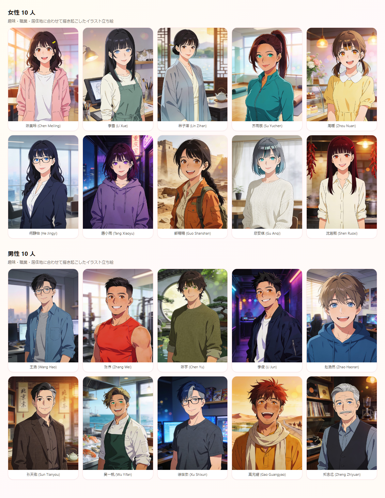
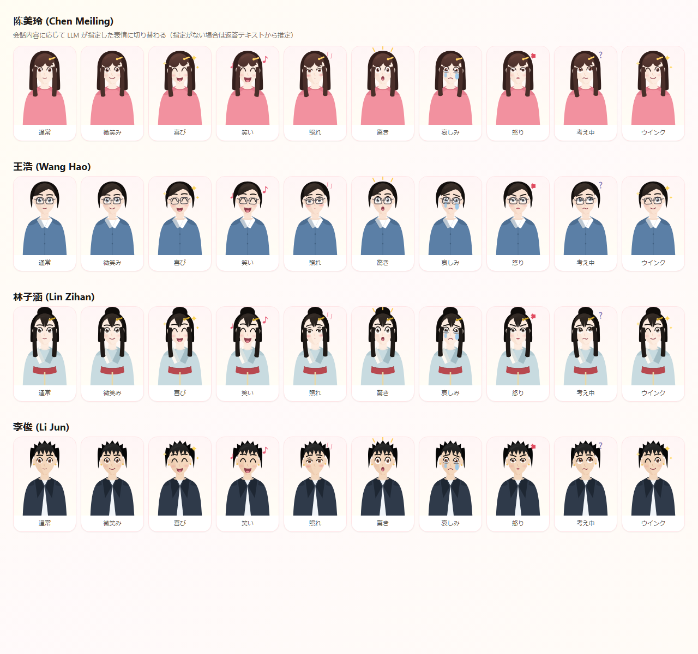
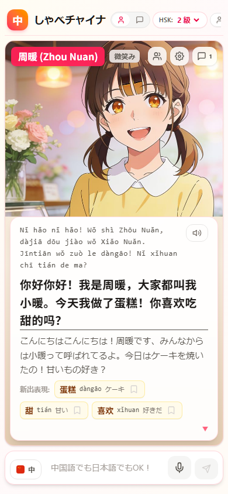
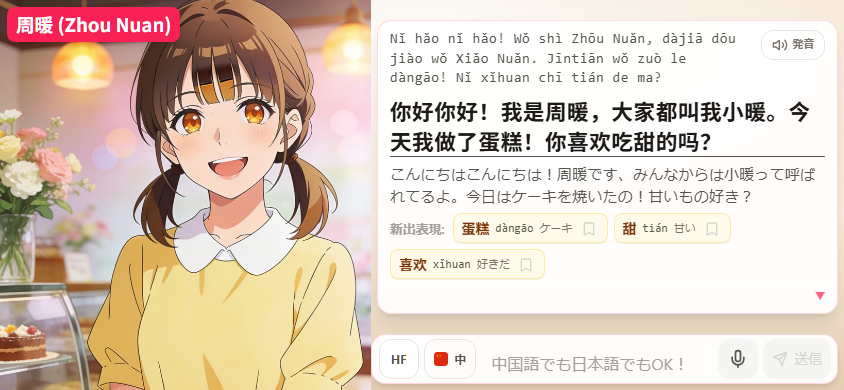
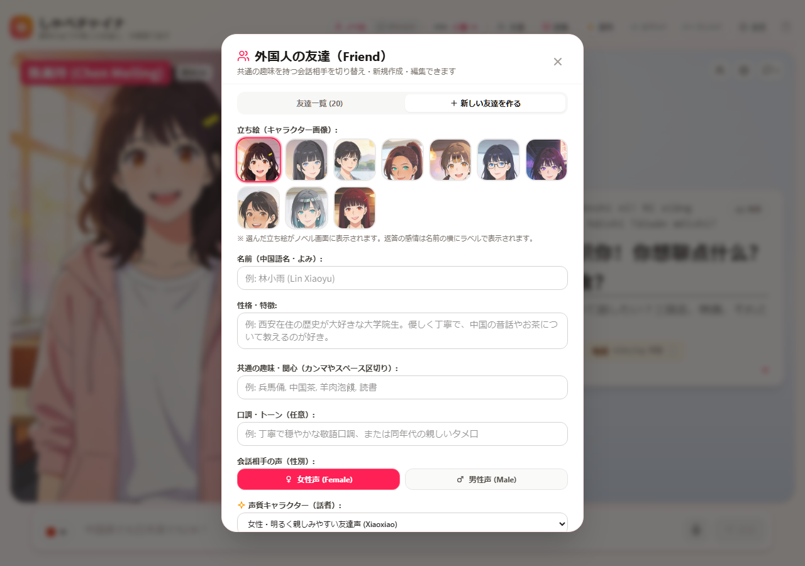
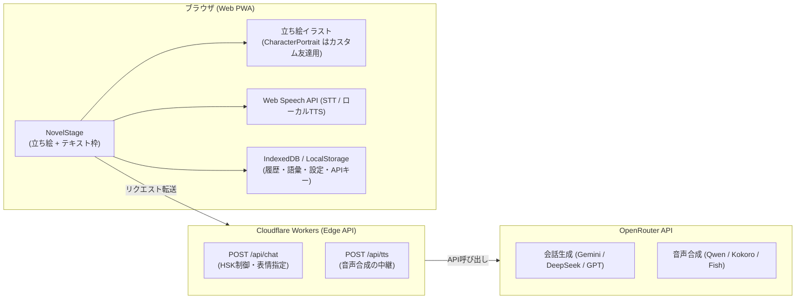

# しゃべチャイナ (Shabe-China) 🇨🇳🗣️

> **「趣味の合う外国人の友達と、中国語で話す。」**
> 片言でも会話が成立し、優しい添削とネイティブ音声が返ってくる。立ち絵つきのサウンドノベル画面で会話する、ブラウザ完結型の中国語会話学習 PWA です。

[](https://try-chinese.molkz.com)
[](https://react.dev/)
[](https://www.typescriptlang.org/)
[](https://tailwindcss.com/)
[](https://openrouter.ai/)

🌐 **公開URL**: [https://try-chinese.molkz.com](https://try-chinese.molkz.com)


---

## 目次

- [しゃべチャイナとは](#しゃべチャイナとは)
- [画面ギャラリー](#画面ギャラリー)
- [主な機能](#主な機能)
- [取扱説明書（使い方ガイド）](#取扱説明書使い方ガイド)
- [登場する友達（20人）](#登場する友達20人)
- [技術スタック & アーキテクチャ](#技術スタック--アーキテクチャ)
- [ローカル開発](#ローカル開発)
- [デプロイ](#デプロイ)
- [ドキュメント](#ドキュメント)
- [変更履歴](#変更履歴)
- [ライセンス](#ライセンス)

---

## しゃべチャイナとは

中国語を「勉強する」のではなく、**趣味の合う友達とおしゃべりする**ことで身につけるためのアプリです。

- 文法が間違っていても、片言でも、日本語混じりでも会話は止まりません。友達が意図を汲んで中国語で返し、そのあとで優しく添削してくれます。
- HSK 1〜6 級の範囲で語彙と文法をコントロールするので、背伸びせずに続けられます。
- 会話画面はチャットではなく**サウンドノベル風の立ち絵つきステージ**。立ち絵とテキスト枠は重ならないよう左右（狭い画面では上下）に分けて配置します。
- API キー・会話履歴・語彙帳はすべてブラウザ内にのみ保存されます。サーバーはプロキシに徹し、ユーザーデータを保持しません。

---

## 画面ギャラリー

### ノベル画面 — 立ち絵と会話する

立ち絵を左、テキスト枠を右に置くので、会話中も相手の顔が隠れません。ピンイン・中国語本文・日本語訳・新出語彙が1枚のテキスト枠にまとまり、添削は折りたたみで控えめに添えられます。返答の感情は名前の横にラベルで表示されます。


### 立ち絵 — 男女10人ずつ、計20体

爽やかなアニメ調のイラスト立ち絵です。趣味・職業・居住地に合わせて背景まで描き分けているため、同じ雰囲気のキャラクターは並びません。



### 表情 — カスタム友達向けの SVG 立ち絵

自分で作った友達にはパラメトリック SVG の立ち絵を割り当てます。こちらは通常・微笑み・喜び・笑い・照れ・驚き・哀しみ・怒り・考え中・ウインクの10表情を持ち、LLM が返答ごとに指定した表情へ切り替わります（指定がない場合は返答テキストから推定）。



### レスポンシブ — 縦画面と横画面

| スマートフォン縦画面 | スマートフォン横画面 |
|---|---|
|  |  |
| 立ち絵が上、テキスト枠が下の上下分割 | 立ち絵が左、テキスト枠が右の2カラム |

横長の画面（PC・タブレット横・スマホ横）では立ち絵を左カラム・テキスト枠を右カラムに分け、縦長の画面では上下に分けます。スマートフォン横画面では立ち絵を優先して広く取り、入力欄とヘッダーを低く保ちます。タイトル・画面モード・HSKは常時表示し、友達・語彙・趣味・音声・設定・履歴削除は「その他」メニューから利用できます。どちらの向きでも本文は立ち絵に重ならず、長い本文と入力内容は各領域内でスクロールできます。

PWAとしてインストールするとスタンドアロン表示になります。対応ブラウザでは「その他」から全画面表示を開始・終了できますが、通常のブラウザタブに表示されるアドレスバー等はWebページ側から確実には非表示にできません。

### チャット画面 — 履歴を一覧で振り返る

ヘッダーの「ノベル / チャット」で切り替えられます。ノベル画面からも会話ログとして同じ内容を開けます。


### 友達の選択と作成

20人から選ぶほか、立ち絵・名前・性格・趣味・口調・声質を指定して自分だけの友達を作成できます。

| 友達一覧 | 友達の作成 |
|---|---|
|  |  |

### AI モデル・音声の設定

OpenRouter API キー1つで、会話生成（LLM）と音声合成（TTS）の両方を賄います。友達ごとの声質設定は全体設定より優先されます。

| AIモデル・キー設定 | 友達ごとの声質設定 |
|---|---|
|  |  |

---

## 主な機能

### 1. 片言・不完全な発話ウェルカム設計

文法が間違っていても AI が意図を理解して会話を続けます。返答の下に控えめな **添削（Correction）** が折りたたまれ、開くと元の表現と自然な中国語を比較できます。日本語と中国語を混ぜた発話にも対応し、意味・読み方を尋ねる自然な質問や意図的な言語切り替えは誤り扱いしません。日本語の会話発話には、まず内容へ答えたうえで中国語での言い方を案内します。

### 2. HSK 1〜6 級の難易度コントロール

ヘッダーからいつでも HSK 級を切り替えられます。級内の語彙・文法を軸にしつつ、不自然に硬くならないよう平易な言い換えを優先します。趣味分野の固有表現（作品名・料理名など）は級を超えても積極的に使われます。

### 3. 立ち絵によるゲーム性

- **立ち絵**: バストアップ（腰から頭まで）のイラスト。趣味・職業・居住地に合わせた背景まで描き込まれています。
- **配置**: テキスト枠と重ならないよう左右（狭い画面では上下）に分割。会話中も顔が隠れません。
- **感情**: LLM が返答ごとに指定した感情を、名前の横にラベルで表示します（指定がない場合は返答テキストから推定）。
- **演出**: 友達を切り替えたときのフェードイン、本文のタイプライター表示（タップでスキップ）。
- **カスタム友達**: 自分で作った友達にはパラメトリック SVG の立ち絵を割り当て、10表情・待機モーション・感情エフェクトが有効になります。
- OS の「動きを減らす」設定を有効にしている場合、これらのアニメーションは自動的に停止します。

### 4. 常時ピンイン & 声調カラーハイライト

すべての中国語にピンインを常時併記します。第1声（赤）・第2声（橙）・第3声（緑）・第4声（青）・軽声（灰）の色分けをワンタップで ON/OFF できます。

### 5. OpenRouter 1本化の音声合成 (TTS)

OpenRouter API キー1つで動作します。選択できるモデル:

| モデル | 目安コスト | 特徴 |
|---|---|---|
| Qwen Audio 3.0 TTS Flash | $15 / 100万tok | 標準推奨。四声と抑揚の自然さが高い |
| Qwen Audio 3.0 TTS Plus | $20 / 100万tok | より繊細な感情表現 |
| Kokoro 82M | $4 / 100万tok | 低コスト。中国語8話者（男女各4）を個別に選択可能 |
| Fish Audio S2.1 Pro Free | 無料枠 | お試し向け |
| ブラウザ標準音声 | 無料 | 端末内蔵の Web Speech API。通信費ゼロ |

#### TTSモデル検証モード（開発・比較用）

開発環境、またはURLに `?ttsDebug=1` を付けた画面では、設定から **「TTSモデル検証モード」** を開けます。同じ中国語・日本語・日中混合テキストを複数モデルで比較し、応答時間、HTTPステータス、推定費用、使用モデル・話者を確認できます。

検証は実際のOpenRouter APIを呼び出します。複数モデル実行前に表示される推定費用を確認してください。直近10件の測定結果はブラウザのIndexedDBに保存されますが、生成音声そのものは保存されません。

### 6. 音声入力（STT）

中国語・日本語の両方に対応した音声認識で文字起こしし、確認してから送信します。通常のマイク入力は1発話ごとの単発認識で、同じ認識結果が再通知されても重複反映しません。音声入力の開始時と回答受信後は入力欄へ自動フォーカスしないため、Androidのソフトキーボードは入力欄を直接タップするまで表示されません。

返答の「自動読み上げ」をONにすれば、音声通話のように練習できます。入力欄の **HF** を押すと継続認識のハンズフリー会話を開始します。沈黙だけでは送信されないため、言葉を考えている途中でも大丈夫です。中国語入力では発話の最後に「发送（fāsòng）」、日本語入力では「送って」と言うと、コマンド部分を除いた本文だけを送信します。友達の返答を読み上げた後はマイクが自動で再開します。HF はページを開くたびに明示的な開始が必要です。

### 7. 語彙帳 & 復習

会話で出た新出表現や添削フレーズを栞アイコンで語彙帳に保存し、フラッシュカードと4択クイズで復習できます。

### 8. 完全 BYO-AI & プライバシー保護

API キー・会話履歴・語彙帳はすべてブラウザ内（IndexedDB / LocalStorage）にのみ保存されます。Cloudflare Workers 側はリクエストの転送に徹し、ユーザーデータを保持しません。

---

## 取扱説明書（使い方ガイド）

### STEP 1: OpenRouter API キーを登録する

1. ヘッダーの **「設定」** を開きます。狭い画面では **「その他」→「設定」** の順に押します。
2. **OpenRouter API Key**（`sk-or-v1-...`）を入力します。お持ちでない場合は [openrouter.ai](https://openrouter.ai/) で作成・チャージしてください。
3. **会話用 AI モデル**（推奨: `Gemini 2.5 Flash`）と **音声合成 TTS モデル**（推奨: `Qwen Audio 3.0 TTS Flash`）を選び、「設定を保存」を押します。
   - 音声だけをキーなしで試したい場合は、読み上げエンジンに「ブラウザ / Edge」を選んでください。会話生成には API キーが必要です。

### STEP 2: 会話相手（友達）を選ぶ

1. ノベル画面の友達アイコン、またはヘッダーの **「友達」** を押します。狭い画面では **「その他」→「友達」** から開けます。
2. 20人の中から趣味や性格の合う相手を選んで「話す」を押します。
3. 「設定」からプロフィールや立ち絵、声質を変更できます。オリジナルの友達も作成できます。
4. 立ち絵横の ⚙️ アイコンから話者を選び、試聴して「保存する」を押すと、その友達専用の声として記録されます。
   - AI 音声には有効な API キーと利用料金が必要です。合成に失敗した場合はブラウザ音声へ自動切り替えせず、エラーを表示します。

### STEP 3: 会話を楽しむ

1. 画面下部の入力欄に入力するか、マイクボタン（🎙️）で話しかけます。
   - **日本語でも中国語でも OK**: 中国語が出てこないときは日本語で構いません。
   - **片言でも OK**: 「我想 去 上海」のような途切れた文でも通じます。
   - **音声入力**: マイク入力後はAndroidのキーボードを自動表示しません。文字を直す場合だけ入力欄をタップしてください。
   - **ハンズフリー**: **HF** を押し、中国語なら最後に「发送」、日本語なら「送って」と言います。沈黙では送信されません。終了するときは HF または停止ボタンを押します。
2. 返答が届きます。
   - **感情**: 返答内容に合わせた感情が、名前の横にラベルで表示されます。
   - **ピンイン**: 本文の上に常時表示されます。
   - **発音ボタン**: ネイティブ音声で読み上げます。
   - **添削**: より自然な表現があれば「添削アドバイス」として折りたたまれます。
   - **新出表現**: 栞（🔖）アイコンで語彙帳に保存できます。
3. 本文はタイプライター表示されます。待ちきれないときはテキスト枠をタップすると全文が出ます。
4. ステージ上の会話ログボタンで過去のやり取りを振り返れます。補助ボタンは約4秒操作がない場合や入力欄のフォーカス中に隠れ、画面をタップすると再表示されます。

### STEP 4: 復習する

1. ヘッダーの **「語彙」** で保存した単語一覧を確認します。狭い画面では **「その他」→「語彙」** から開けます。
2. **「復習クイズを始める」** でフラッシュカードと4択クイズに進みます。

---

## 登場する友達（20人）

立ち絵・声質・出身地・職業・趣味がそれぞれ異なります。

### 女性

| 名前 | 居住地・職業 | 趣味 |
|---|---|---|
| 陈美玲 (Chen Meiling) | 上海・大学生 | 三国志、映画鑑賞、台湾料理 |
| 李雪 (Li Xue) | 成都・グラフィックデザイナー | 四川料理・火鍋、アート、猫、旅行 |
| 林子涵 (Lin Zihan) | 杭州・写真家 / 旅行ブロガー | 風景写真、中国茶、歴史文化・漢服 |
| 苏雨辰 (Su Yuchen) | 厦門・ヨガ / ランニングコーチ | ヨガ、海辺の散歩、健康料理 |
| 周暖 (Zhou Nuan) | 昆明・パティシエ見習い | お菓子作り、花・植物、パンダ |
| 何静怡 (He Jingyi) | 深圳・金融アナリスト | 読書、ジャズ、都市・建築、語学学習 |
| 唐小雨 (Tang Xiaoyu) | 重慶・バンドのベーシスト | 音楽、ライブハウス、夜景、バイク |
| 郭珊珊 (Guo Shanshan) | 西安・考古学専攻の大学院生 | 歴史・遺跡、バックパック旅行、西安グルメ |
| 顾安琪 (Gu Anqi) | 大連・通訳者 | インテリア、映画音楽、静かなカフェ |
| 沈若熙 (Shen Ruoxi) | 長沙・家庭料理店の若女将 | 湖南料理、市場めぐり、ドラマ鑑賞 |

### 男性

| 名前 | 居住地・職業 | 趣味 |
|---|---|---|
| 王浩 (Wang Hao) | 北京・IT エンジニア | テクノロジー・AI、ゲーム、SF小説 |
| 张伟 (Zhang Wei) | 広州・フィットネスインストラクター | ランニング、広東飲茶、スポーツ観戦 |
| 陈宇 (Chen Yu) | 蘇州・造園職人 | 庭園・盆栽、園芸、二十四節気 |
| 李俊 (Li Jun) | 深圳・ストリートダンサー / DJ | ダンス、ヒップホップ、スニーカー |
| 赵浩然 (Zhao Haoran) | 武漢・大学生（eスポーツ部） | eスポーツ、アニメ、武漢グルメ |
| 孙天佑 (Sun Tianyou) | 北京・大学講師（中国史） | 中国史、書道、古典詩、茶館 |
| 吴一帆 (Wu Yifan) | 青島・海鮮レストランのシェフ | 海鮮料理、釣り、ビール、市場めぐり |
| 徐世勋 (Xu Shixun) | 杭州・ゲーム開発者 | ゲーム開発、SF映画、ボードゲーム |
| 高光耀 (Gao Guangyao) | 新疆・ツアーガイド | シルクロード、羊肉料理、砂漠の星空 |
| 郑志远 (Zheng Zhiyuan) | 天津・ジャズ喫茶のマスター | コーヒー、ジャズ・レコード、古い映画 |

---

## 技術スタック & アーキテクチャ



| 領域 | 技術 | 詳細 |
|---|---|---|
| **Frontend** | React + TypeScript | React 19, Strict Mode, `any` 不使用 |
| **Build** | Vite | Vite 8, `vite-plugin-pwa`（オフライン / インストール対応） |
| **Styling** | Tailwind CSS | Tailwind CSS v4 + 素の CSS（アニメーション・レイアウト） |
| **キャラクター** | イラスト画像 + インライン SVG | プリセット20体はイラスト立ち絵。カスタム友達は SVG をパラメータで生成 |
| **Backend** | Cloudflare Workers | Hono、エッジ実行、Static Assets で SPA も同居 |
| **AI Hub** | OpenRouter API | Chat Completions + OpenAI 互換 TTS |
| **保存先** | Web Storage | LocalStorage / IndexedDB（完全クライアント保持） |

### 主要ディレクトリ

```
web/src/
├── components/
│   ├── NovelStage.tsx          ノベル画面（立ち絵 + テキスト枠）
│   ├── PortraitFace.tsx        立ち絵から切り出す顔アイコン
│   ├── CharacterPortrait.tsx   SVG 立ち絵の描画（カスタム友達用のフォールバック）
│   ├── SceneBackdrop.tsx       SVG 立ち絵の背景シーン
│   ├── ChatLogModal.tsx        会話ログ（バックログ）
│   ├── TtsDebugModal.tsx       OpenRouter TTSモデル検証画面
│   └── ...                     ヘッダー・入力欄・各種モーダル
├── data/
│   ├── portraits.ts            立ち絵の定義（20体・イラストURLの解決）
│   ├── portraitParts.ts        SVG 立ち絵の髪型・体型パス定義
│   ├── presetFriends.ts        プリセットの友達（20人）
│   ├── characterVoices.ts      話者プリセット
│   └── openRouterTtsModels.ts  TTS検証候補と料金・話者メタデータ
├── services/
│   ├── api.ts                  /api/chat の呼び出し
│   ├── expression.ts           表情の検証とテキストからの推定
│   ├── speech.ts               STT / TTS
│   ├── ttsDebug.ts             TTS検証実行・計測・費用概算
│   ├── ttsDebugStorage.ts      TTS検証履歴のIndexedDB保存
│   └── storage.ts              ブラウザ保存
└── preview.tsx                 立ち絵カタログ（開発用・本番ビルドには含まれない）

web/public/portraits/           立ち絵イラスト20枚（pt-*.jpg / 720x960）

worker/src/
├── routes/chat.ts              POST /api/chat
├── routes/tts.ts               POST /api/tts
└── lib/prompt.ts               HSK 級別制御・添削・表情指定のプロンプト
```

---

## ローカル開発

### 1. クローンと依存関係

```bash
git clone https://github.com/Satoshi-Hiramatsu/try-chinese.git
cd try-chinese
npm install
```

### 2. 環境変数（任意）

`worker/.dev.vars` に開発用の OpenRouter キーを置けます。設定しなくても、ブラウザの設定画面からキーを入力すれば動作します。

```ini
OPENROUTER_API_KEY=sk-or-v1-xxxxxxxxxxxxxxxxxxxx
OPENROUTER_MODEL=google/gemini-2.5-flash
```

> API キーは絶対にコミットしないでください。`.dev.vars*` は `.gitignore` 済みです。

### 3. 開発サーバー

```bash
npm run dev:web      # フロントエンド (http://localhost:5173)
npm run dev:worker   # Workers API (http://localhost:8787)
```

フロントエンドの `/api` リクエストは Vite の proxy 経由で Workers に転送されます。

立ち絵のカタログは `http://localhost:5173/preview.html` で確認できます（`?view=portraits` / `?view=expressions` / `?view=icons`）。この画面は開発専用で、本番ビルドには含まれません。

### 4. テストとビルド

```bash
npm test        # React Hooks 検査 + Web テスト (node:test) + Workers テスト (Vitest)
npm run build   # Web ビルド + Worker 型チェック
```

Web側では、立ち絵・表情に加え、音声認識結果の重複抑止、単発／継続認識の切り替え、音声コマンド、TTSモデル定義と費用概算を検証しています。

### 5. スクリーンショットの更新

README の画像は `.github/readme-showcase.json` の定義に従って再現できます。

```bash
# 初回のみ（playwright は package.json に登録していません）
npm install --no-save playwright
npx playwright install chromium

# 開発サーバーを起動したうえで
npm run dev:web -- --port 5177 --strictPort
node scripts/capture-screenshots.mjs              # 全件
node scripts/capture-screenshots.mjs desktop-novel # ID 指定
```

---

## デプロイ

Cloudflare Workers の Static Assets により、フロントエンドと API が単一の Worker として配信されます。

```bash
npm run deploy   # ビルドしてから wrangler deploy を実行
```

---

## ドキュメント

| ファイル | 内容 |
|---|---|
| [要件定義書.md](要件定義書.md) | 何を作るか、どんな体験にするか |
| [用語定義書.md](用語定義書.md) | ドメイン用語とコード上の型・変数の対応 |
| [開発フロー（詳細）.md](開発フロー（詳細）.md) | 開発の進め方 |
| [CLAUDE.md](CLAUDE.md) / [AGENTS.md](AGENTS.md) | AI コーディングエージェント向けの規約 |
| [日中混合読み上げ音声の保留案.md](docs/日中混合読み上げ音声の保留案.md) | Kokoro 82M を前提とした、後日検討用の日中混合読み上げ設計 |
| [CHANGELOG.md](CHANGELOG.md) | すべてのタスク（T-00 〜）の変更履歴 |

---

## 変更履歴

すべての変更は [CHANGELOG.md](CHANGELOG.md) に記録しています。最新は **T-43: スマートフォン横画面の会話レイアウト改善** です。

---

## ライセンス

MIT License
